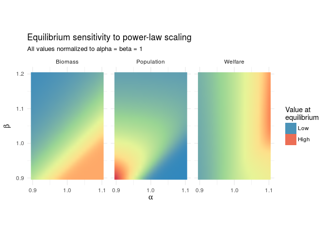
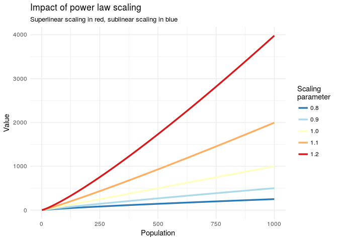

# R Notebook

Analysis of equilibrium resonse to power law scaling behaviors, single-consumer resource case.


```r
library(tidyverse)
```


```r
dat <- read_csv('socio-eco-nw equilibrium-pop-table.csv', skip = 6) %>%
  select(alpha, beta, h = 3, Population = 12) %>%
  full_join((read_csv('socio-eco-nw equilibrium-bio-table.csv', skip = 6) %>%
  select(alpha, beta, Biomass = 12))) %>%
  mutate(Welfare = Biomass * h * Population^(beta-1)) %>%
  select(-h)
```

Find equilibrium values

```r
dat %>% filter(alpha == 1 & beta == 1) %>% select(3:5)
```

```
## # A tibble: 1 × 3
##   Population Biomass Welfare
##        <dbl>   <dbl>   <dbl>
## 1      60000     0.4   4e-07
```
Normalize data using equilibrium values

```r
dat.norm <- dat %>% 
  mutate(Population = Population / 60000, Biomass = Biomass / .4, Welfare = Welfare / 4e-07)
```


```r
dat.norm %>% gather(variable, value, Population:Welfare) %>%
  ggplot(aes(alpha, beta, fill = value)) +
    facet_wrap(~variable) +
    geom_raster(interpolate = T) +
    labs(title = 'Equilibrium sensitivity to power-law scaling', subtitle = 'All values normalized to alpha = beta = 1', x = expression(alpha), y = expression(beta)) +
    scale_fill_distiller(name = 'Value at \nequilibrium', palette = 'Spectral', guide = 'legend', breaks = c(.1,3),labels = c('Low', 'High')) +
    scale_x_continuous(breaks = c(.9, 1, 1.1)) +
    coord_equal() +
    theme_minimal()
```

<!-- -->
In natural language, resource biomass is highest when higher population leads to declining marignal returns to harvest

## alpha beta plots
plots of how different exponents effect population size

```r
dat <- data_frame(n = 1:1000) %>%
  mutate('0.8' = n^.8,
         '0.9' = n^.9,
         '1.0' = n^1,
         '1.1' = n^1.1,
         '1.2' = n^1.2) %>%
  gather(key, value, 2:6)

ggplot(dat, aes(x = n, y = value, color = key)) +
  geom_line(size = 1.2) +
  labs(title = 'Impact of power law scaling', subtitle = 'Superlinear scaling in red, sublinear scaling in blue', x = 'Population', y = 'Value') +
  scale_color_brewer(palette = 'RdYlBu', direction = -1, name = 'Scaling \nparameter') +
  theme_minimal()
```

<!-- -->


