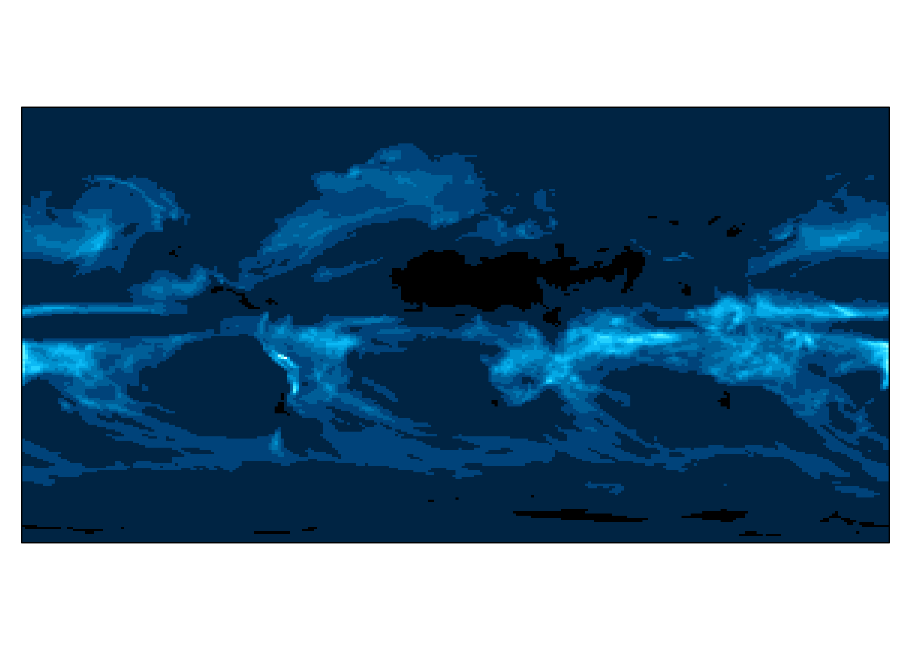
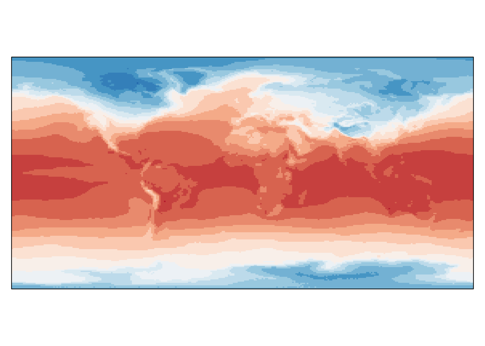
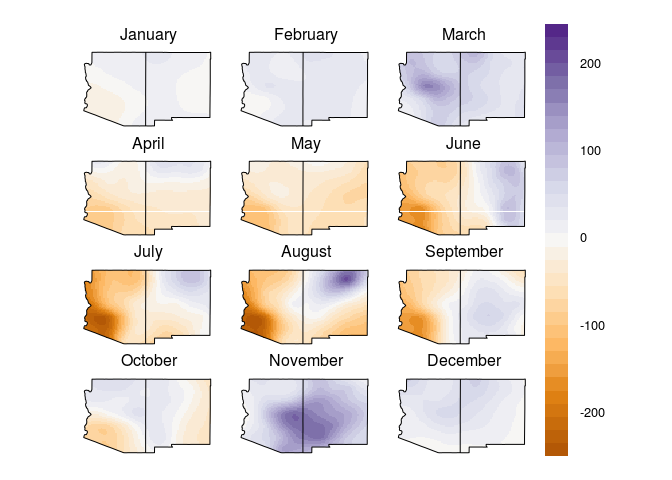

# Extra Figures


```r
library(raster)
```

```
## Loading required package: sp
```

```r
library(rasterVis)
```

```
## Loading required package: lattice
```

```
## Loading required package: latticeExtra
```

```
## Loading required package: RColorBrewer
```

```r
library(magrittr)
```

```
## 
## Attaching package: 'magrittr'
```

```
## The following object is masked from 'package:raster':
## 
##     extract
```


```r
brick('Data/b40.lm850-1850.1deg.001.cam2.h0.PRECT.085001-185012.nc') %>% 
  extract2(1) %>% 
  rotate %>%
  multiply_by(2.628e+9) %>%
  levelplot(margin = F, par.settings = BTCTheme(), colorkey = F, xlab=NULL, ylab=NULL, scales=list(draw=FALSE))
```

```
## Loading required namespace: ncdf4
```

<!-- -->

```r
mean((brick('Data/b40.lm850-1850.1deg.001.cam2.h0.TREFMNAV.085001-185012.nc') %>%
  extract2(1) %>%
  rotate %>%
  subtract(273.15)),
(brick('Data/b40.lm850-1850.1deg.001.cam2.h0.TREFMXAV.085001-185012.nc') %>%
  extract2(1) %>%
  rotate %>%
  subtract(273.15))) %>%
  levelplot(margin = F, par.settings = BuRdTheme(), colorkey = F,xlab=NULL, ylab=NULL, scales=list(draw=FALSE))
```

<!-- -->


```r
library(maps)
library(maptools)
```

```
## Checking rgeos availability: TRUE
```

```r
states.ply <- map('state', region = c('arizona', 'new mexico'), fill = T, plot = F)
IDs <- sapply(strsplit(states.ply$names, ":"), function(x) x[1])
states.ply <- map2SpatialPolygons(states.ply, IDs=IDs)
#assumes you have water stress map from sw_variability scitp
ws.map <- brick('Data/water_stress.nc')
ws.map.plot <- disaggregate(ws.map[[1:12]],fac = 5)
levelplot(mask(ws.map.plot, states.ply), names.attr = month.name, at = seq(-250,250, 15), xlab=NULL, ylab=NULL, scales=list(draw=FALSE), par.settings = PuOrTheme(axis.line = list(col = "transparent"))) +
  layer(sp.polygons(states.ply))
```

<!-- -->

