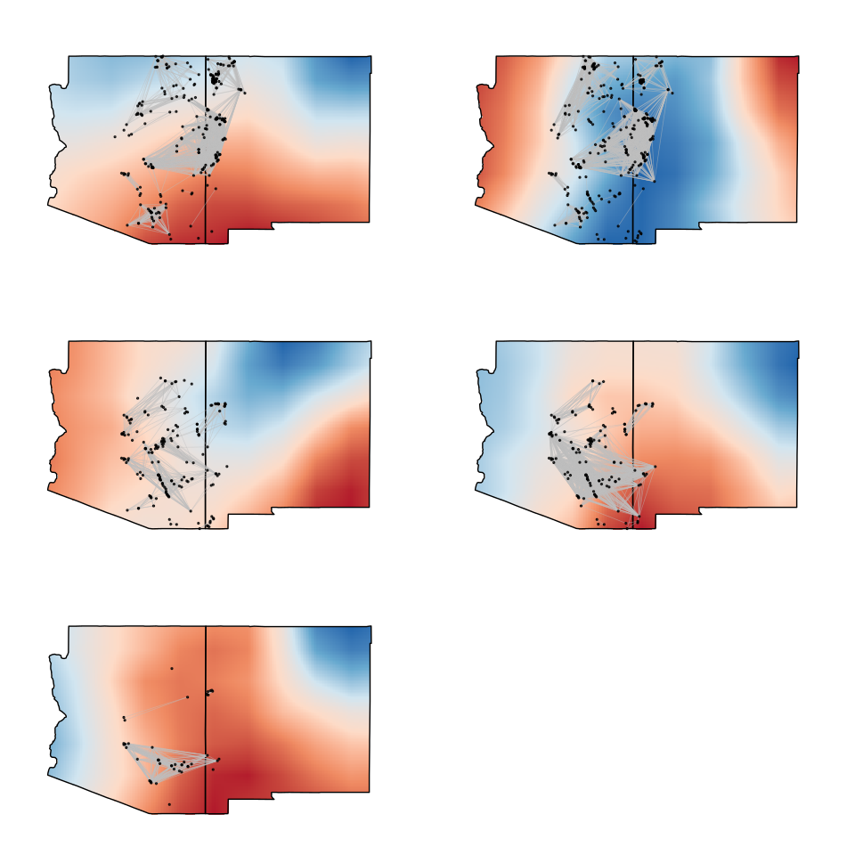

# Southwest Social Networks
Nick Gauthier  
# Data import

First import the SWSN attribute file. Use tidyverse packages for data munging.

Site coordinates are in UTM, so first use rgdal to reproject to LatLon.

```r
library(tidyverse)
library(rgdal)

swsn.pts <- read_csv('Data/attributes_orig.csv') %>% 
  select(easting = EASTING, northing = NORTHING) %>%
  SpatialPoints(proj4string=CRS("+proj=utm +zone=12 +datum=WGS84")) %>%
  spTransform(CRS("+proj=longlat +datum=WGS84")) %>% 
  coordinates %>%
  data.frame
```

Now reimport the attribute file, select the relevant data, and combine with the reprojected site coordinates.

```r
swsn.attr <- read_csv('Data/attributes_orig.csv') %>%
  select(ID = SWSN_ID, site = SWSN_Site, macro = Macro, micro = Micro) %>%
  cbind(swsn.pts)
```

Now define a function to import the SWSN adjacency matrix for a given time step. This function imports the adjacency matrix, keeps only those connections with >= 75% similarity, and creates an igraph object. Then it adds attribute data from above to the graph object.

```r
library(igraph)

readSWSN <- function(net){
  net.in <- read.csv(net, row.names = 1, check.names = F) 
  net.in[net.in < .75] <- 0
  net.in <- net.in %>% 
    as.matrix %>%
    graph_from_adjacency_matrix(mode = 'undirected', weighted = T, diag = F)
  
  ord <- match(V(net.in)$name, swsn.attr$site)

  V(net.in)$lon <- swsn.attr[ord, 5]
  V(net.in)$lat <- swsn.attr[ord, 6]
  V(net.in)$region <- swsn.attr[ord, 3] %>% as.character
  
  return(net.in)
}
```

Use the function to import the network datasets.

```r
ad1200 <- readSWSN('Data/AD1200sim.csv')
ad1250 <- readSWSN('Data/AD1250sim.csv')
ad1300 <- readSWSN('Data/AD1300sim.csv')
ad1350 <- readSWSN('Data/AD1350sim.csv')
ad1400 <- readSWSN('Data/AD1400sim.csv')
```

# Plotting

First get a terrain basemap to plot the networks over. The terrain-background basemap from Stamen is a nice choice. Download this map and store a ggmap plot of it.

```r
library(ggmap)
terrain.background <- get_map(location = c(left = -113.5, right = -106.5, bottom = 31, top = 37.5),
  zoom = 8,
  color = "color",
  source = "stamen",
  maptype = "terrain-background")

map <- ggmap(terrain.background)  +
  labs(x = "Longitude", y = "Latitude")
```

Now plot the networks.


## More Minimal network maps


```r
library(GGally)
```

```
## 
## Attaching package: 'GGally'
```

```
## The following object is masked from 'package:dplyr':
## 
##     nasa
```

```r
library(ggmap)
library(maps)
```

```
## 
## Attaching package: 'maps'
```

```
## The following object is masked from 'package:purrr':
## 
##     map
```

```r
library(raster)
```

```
## 
## Attaching package: 'raster'
```

```
## The following object is masked from 'package:dplyr':
## 
##     select
```

```
## The following object is masked from 'package:tidyr':
## 
##     extract
```

```r
library(maptools)
```

```
## Checking rgeos availability: TRUE
```

```r
states <- map('state', regions = c('arizona', 'new mexico'), fill = T, plot = F)
IDs <- sapply(strsplit(states$names, ":"), function(x) x[1])
states.ply <- map2SpatialPolygons(states, IDs=IDs)


base <- ggplot(data = states) +
  geom_polygon(aes(x = long, y = lat, group = region), color = 'black', fill = 'white') +
  coord_quickmap() +
  theme_minimal() +
  labs(x = "Longitude", y = "Latitude")

n1 <- ggnetworkmap(base, ad1200, great.circles = T, size = .5, segment.alpha = I(.5)) +
  geom_label(x = -106, y = 35, label = 'AD 1200')
```

```
## Loading required package: network
```

```
## network: Classes for Relational Data
## Version 1.13.0 created on 2015-08-31.
## copyright (c) 2005, Carter T. Butts, University of California-Irvine
##                     Mark S. Handcock, University of California -- Los Angeles
##                     David R. Hunter, Penn State University
##                     Martina Morris, University of Washington
##                     Skye Bender-deMoll, University of Washington
##  For citation information, type citation("network").
##  Type help("network-package") to get started.
```

```
## 
## Attaching package: 'network'
```

```
## The following objects are masked from 'package:igraph':
## 
##     add.edges, add.vertices, %c%, delete.edges, delete.vertices,
##     get.edge.attribute, get.edges, get.vertex.attribute,
##     is.bipartite, is.directed, list.edge.attributes,
##     list.vertex.attributes, %s%, set.edge.attribute,
##     set.vertex.attribute
```

```
## Loading required package: sna
```

```
## Loading required package: statnet.common
```

```
## sna: Tools for Social Network Analysis
## Version 2.4 created on 2016-07-23.
## copyright (c) 2005, Carter T. Butts, University of California-Irvine
##  For citation information, type citation("sna").
##  Type help(package="sna") to get started.
```

```
## 
## Attaching package: 'sna'
```

```
## The following objects are masked from 'package:igraph':
## 
##     betweenness, bonpow, closeness, components, degree,
##     dyad.census, evcent, hierarchy, is.connected, neighborhood,
##     triad.census
```

```
## Loading required package: geosphere
```

```r
n2 <- ggnetworkmap(base, ad1250, great.circles = T, size = .5, segment.alpha = I(.5)) +
  geom_label(x = -106, y = 35, label = 'AD 1250')

n3 <- ggnetworkmap(base, ad1300, great.circles = T, size = .5, segment.alpha = I(.5)) +
  geom_label(x = -106, y = 35, label = 'AD 1300')

n4 <- ggnetworkmap(base, ad1350, great.circles = T, size = .5, segment.alpha = I(.5)) +
  geom_label(x = -106, y = 35, label = 'AD 1350')

n5 <- ggnetworkmap(base, ad1400, great.circles = T, size = .5, segment.alpha = I(.5)) +
  geom_label(x = -106, y = 35, label = 'AD 1400')

plotEOF <- function(x){
  rasterVis::gplot(x) +
  geom_raster(aes(fill = value), na.rm = T, show.legend = F) +
  scale_fill_distiller(palette = 'RdBu', na.value = NA) +
  geom_polygon(data = states, aes(x = long, y = lat, group = region), color = 'black', fill = NA) +
  coord_quickmap() +
  theme_minimal() +
  labs(x = "Longitude", y = "Latitude")
}

eof1200 <- brick('eof1200.nc')[[3]] %>%
  mask(states.ply) %>% 
  plotEOF
```

```
## Loading required namespace: ncdf4
```

```r
e1 <- ggnetworkmap(eof1200, ad1200, great.circles = T, size = .5, segment.alpha = I(.5))# + geom_label(x = -106, y = 35, label = 'AD 1200')

  
eof1250 <- brick('eof1250.nc')[[3]] %>%
  mask(states.ply) %>%
    plotEOF


e2 <- ggnetworkmap(eof1250, ad1250, great.circles = T, size = .5, segment.alpha = I(.5)) #+  geom_label(x = -106, y = 35, label = 'AD 1250')

eof1300 <- brick('eof1300.nc')[[3]] %>%
  mask(states.ply) %>%
    plotEOF

e3 <- ggnetworkmap(eof1300, ad1300, great.circles = T, size = .5, segment.alpha = I(.5))# + geom_label(x = -106, y = 35, label = 'AD 1300')

eof1350 <- brick('eof1350.nc')[[3]] %>%
  mask(states.ply) %>%
    plotEOF

e4 <- ggnetworkmap(eof1350, ad1350, great.circles = T, size = .5, segment.alpha = I(.5)) #+ geom_label(x = -106, y = 35, label = 'AD 1350')

eof1400 <- brick('eof1400.nc')[[3]] %>%
  mask(states.ply) %>%
    plotEOF

e5 <- ggnetworkmap(eof1400, ad1400, great.circles = T, size = .5, segment.alpha = I(.5)) #+ geom_label(x = -106, y = 35, label = 'AD 1400')
```
Get basemap for elevation.


```r
#multiplot(n1, n2, n3, n4, n5, m1, layout = matrix(c(1,2,3,4,5,6), byrow = T, nrow = 3))
multiplot(e1, e2, e3, e4, e5, layout = matrix(c(1,2,3,4,5,6), byrow = T, nrow = 3))
```

<!-- -->

