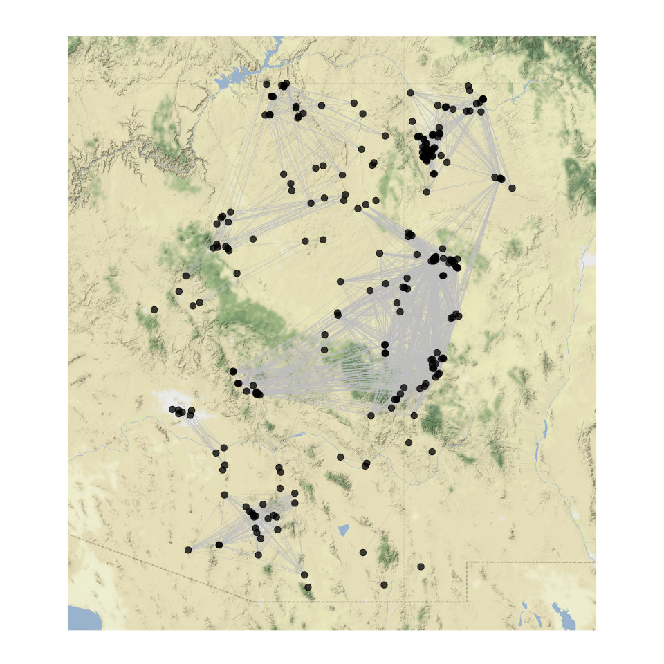
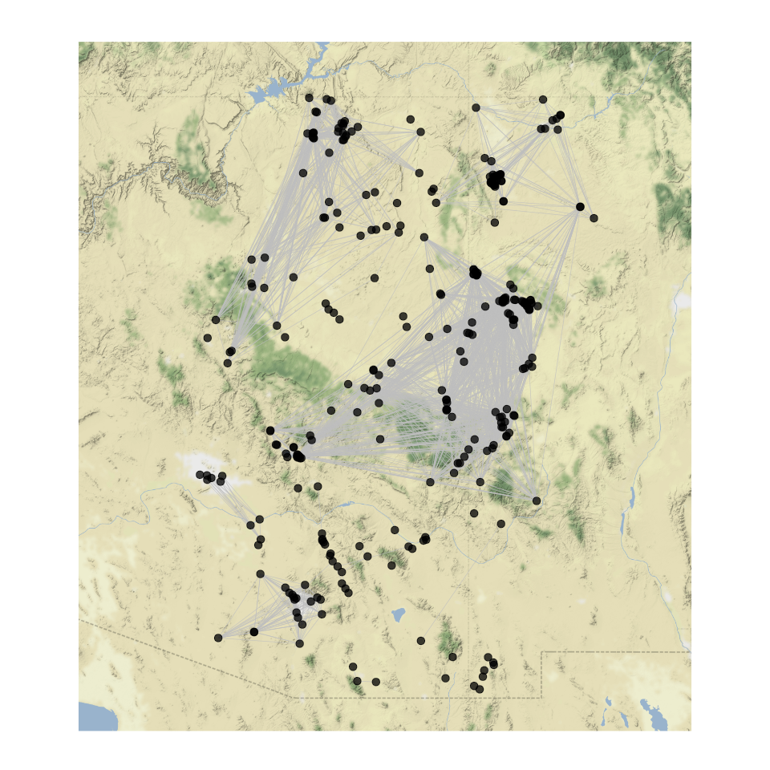
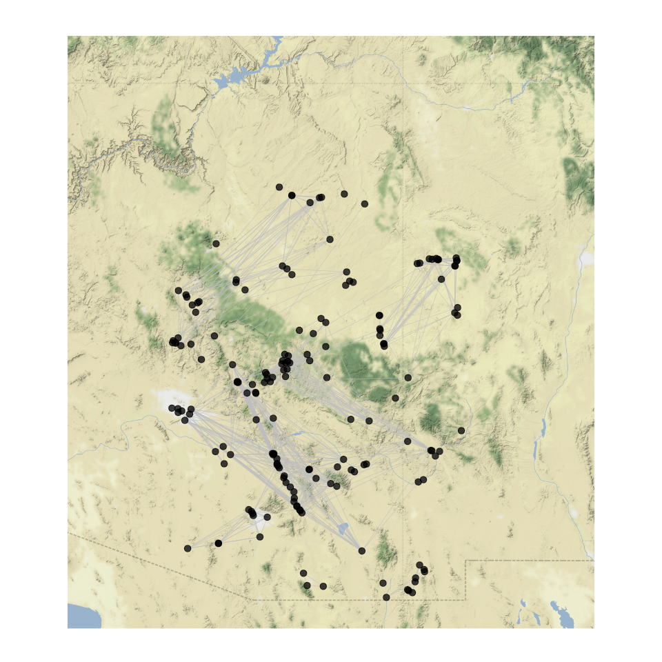
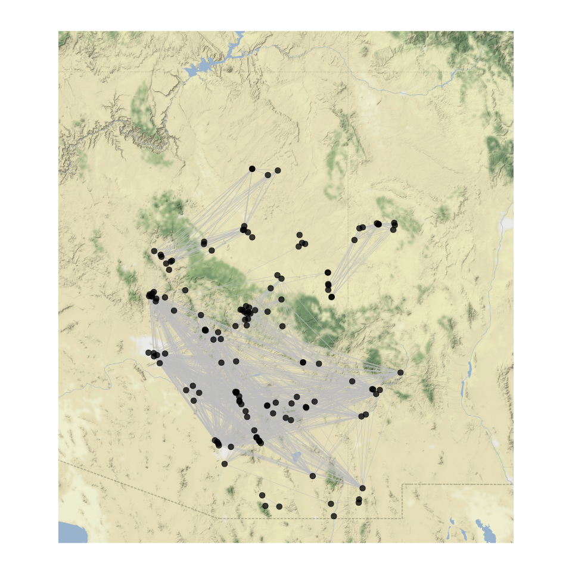
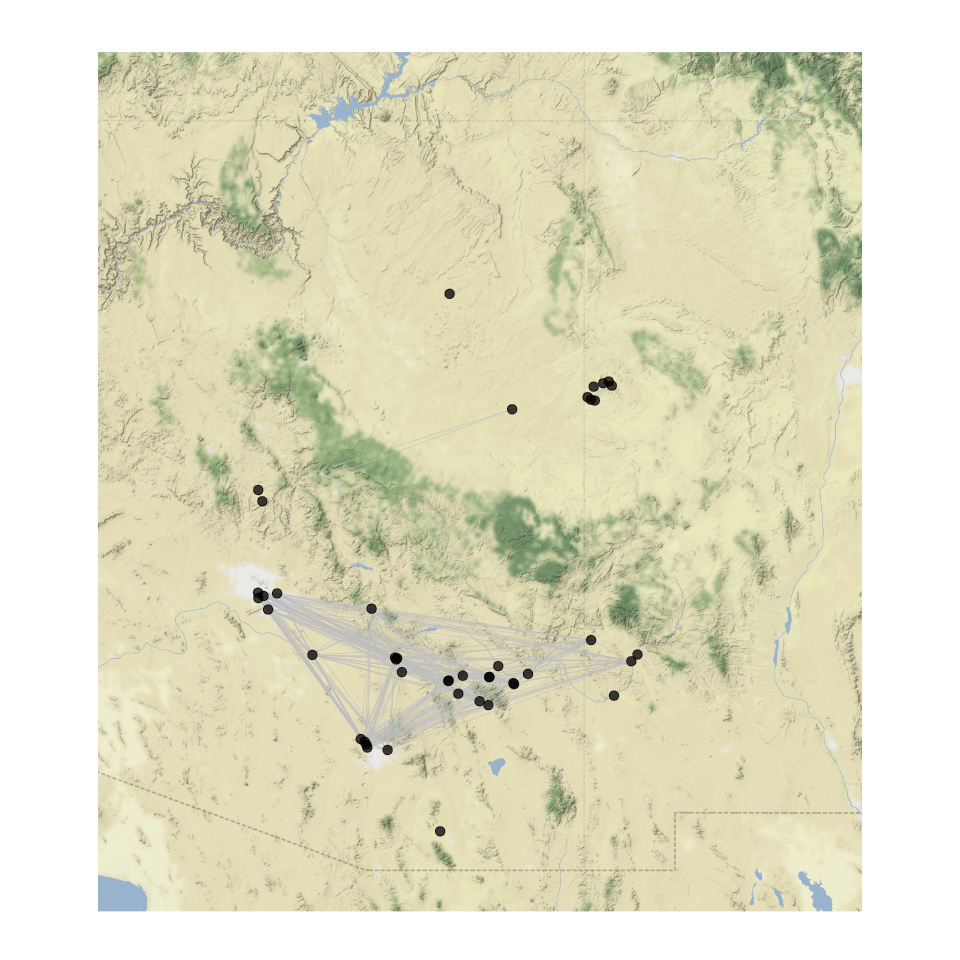

# Southwest Social Networks
Nick Gauthier  
# Data import

First import the SWSN attribute file. Use tidyverse packages for data munging.

Site coordinates are in UTM, so first use rgdal to reproject to LatLon.

```r
library(tidyverse)
library(rgdal)

swsn.pts <- read_csv('Data/attributes_orig.csv') %>% 
  select(easting = EASTING, northing = NORTHING) %>%
  SpatialPoints(proj4string=CRS("+proj=utm +zone=12 +datum=WGS84")) %>%
  spTransform(CRS("+proj=longlat +datum=WGS84")) %>% 
  coordinates %>%
  data.frame
```

Now reimport the attribute file, select the relevant data, and combine with the reprojected site coordinates.

```r
swsn.attr <- read_csv('Data/attributes_orig.csv') %>%
  select(ID = SWSN_ID, site = SWSN_Site, macro = Macro, micro = Micro) %>%
  cbind(swsn.pts)
```

Now define a function to import the SWSN adjacency matrix for a given time step. This function imports the adjacency matrix, keeps only those connections with >= 75% similarity, and creates an igraph object. Then it adds attribute data from above to the graph object.

```r
library(igraph)

readSWSN <- function(net){
  net.in <- read.csv(net, row.names = 1, check.names = F) 
  net.in[net.in < .75] <- 0
  net.in <- net.in %>% 
    as.matrix %>%
    graph_from_adjacency_matrix(mode = 'undirected', weighted = T, diag = F)
  
  ord <- match(V(net.in)$name, swsn.attr$site)

  V(net.in)$lon <- swsn.attr[ord, 5]
  V(net.in)$lat <- swsn.attr[ord, 6]
  V(net.in)$region <- swsn.attr[ord, 3] %>% as.character
  
  return(net.in)
}
```

Use the function to import the network datasets.

```r
ad1200 <- readSWSN('Data/AD1200sim.csv')
ad1250 <- readSWSN('Data/AD1250sim.csv')
ad1300 <- readSWSN('Data/AD1300sim.csv')
ad1350 <- readSWSN('Data/AD1350sim.csv')
ad1400 <- readSWSN('Data/AD1400sim.csv')
```

# Plotting

First get a terrain basemap to plot the networks over. The terrain-background basemap from Stamen is a nice choice. Download this map and store a ggmap plot of it.

```r
library(ggmap)
terrain.background <- get_map(location = c(left = -113.5, right = -106.5, bottom = 31, top = 37.5),
  zoom = 8,
  color = "color",
  source = "stamen",
  maptype = "terrain-background")

map <- ggmap(terrain.background)  +
  labs(x = "Longitude", y = "Latitude")
```

Now plot the networks.


```r
library(GGally)

ggnetworkmap(map, ad1200) +
  guides(size = F)
```

<!-- -->

```r
ggsave('ad1200.png')

ggnetworkmap(map, ad1250) +
  guides(size = F)
```

<!-- -->

```r
ggsave('ad1250.png')

ggnetworkmap(map, ad1300) +
  guides(size = F)
```

<!-- -->

```r
ggsave('ad1300.png')

ggnetworkmap(map, ad1350) +
  guides(size = F)
```

<!-- -->

```r
ggsave('ad1350.png')

ggnetworkmap(map, ad1400) +
  guides(size = F)
```

<!-- -->

```r
ggsave('ad1400.png')
```

