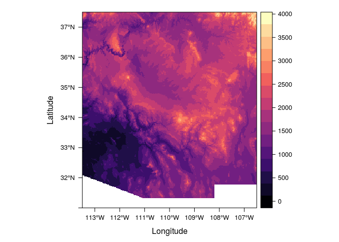
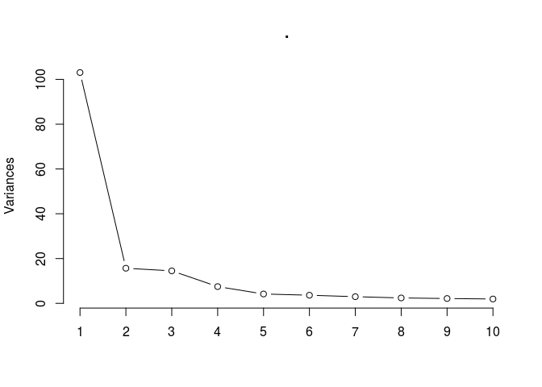
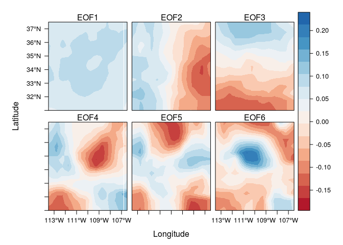
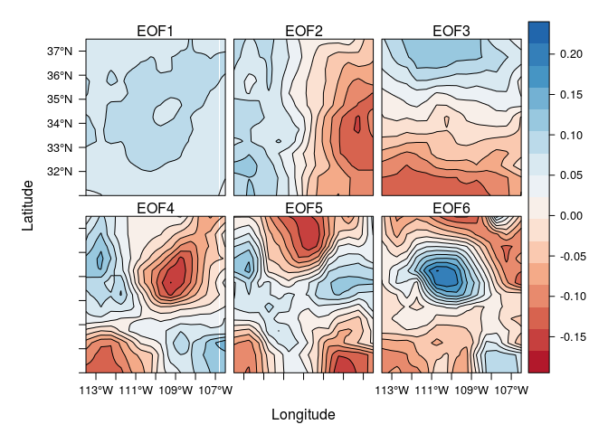

# Southwest Climate Variability
Nicolas Gauthier  


```r
library(magrittr)
library(raster)
library(ncdf4)
library(spacetime)
library(rasterVis)
```


```r
#elev <- getData('alt', country = 'USA') %>% crop(extent(c(-113.5, -106.5, 31, 37.5))) # if you need to download elevation data
elev <- raster('USA1_msk_alt.grd') %>% crop(extent(c(-113.5, -106.5, 31, 37.5)))
levelplot(elev, margin = F)
```

<!-- -->


```r
prec <- brick('~/Downloads/spei12.nc') %>%
  crop(extent(c(-113.5, -106.5, 31, 37.5)), snap = 'out')
```


```r
stfdf <- prec %>% as('STFDF')
```


```r
## attempt to compute EOFs
#eof_time <- eof(stfdf, 'temporal')
eof_space <- eof(stfdf, 'spatial') %>% brick %>% extract2(1:6) %>% resample(elev)
eof(stfdf, 'spatial', returnEOFs = F) %>% screeplot(type = 'lines')
```

<!-- -->


```r
levelplot(eof_space, par.settings = RdBuTheme(), contour = F)
```

<!-- -->

```r
levelplot(eof_space, par.settings = RdBuTheme(), contour = T)
```

<!-- -->


