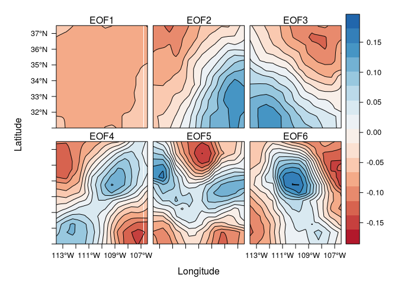
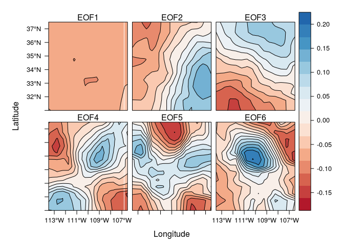
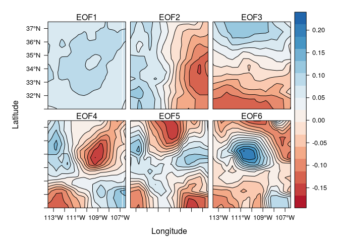
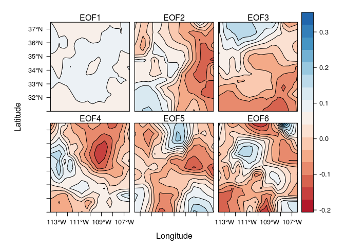
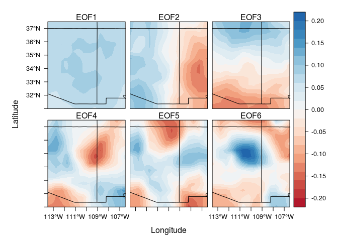

# Southwest Climate Variability
Nicolas Gauthier  


```r
library(magrittr)
library(raster)
library(ncdf4)
library(spacetime)
library(rasterVis)
```


```r
#elev <- getData('alt', country = 'USA') %>% crop(extent(c(-113.5, -106.5, 31, 37.5))) # if you need to download elevation data
elev <- raster('USA1_msk_alt.grd') %>% crop(extent(c(-113.5, -106.5, 31, 37.5)))
levelplot(elev, margin = F)
```

<!-- -->


```r
box <- extent(c(-113.5, -106.5, 31, 37.5))

brick('~/Downloads/spei03.nc') %>%
  crop(box, snap = 'out') %>% 
  as('STFDF') %>%
  eof('spatial') %>%
  brick %>%
  extract2(1:6) %>% 
  resample(elev) %>%
  levelplot(par.settings = RdBuTheme(), contour = T)
```

<!-- -->

```r
brick('~/Downloads/spei06.nc') %>%
  crop(box, snap = 'out') %>% 
  as('STFDF') %>%
  eof('spatial') %>%
  brick %>%
  extract2(1:6) %>% 
  resample(elev) %>%
  levelplot(par.settings = RdBuTheme(), contour = T)
```

<!-- -->

```r
brick('~/Downloads/spei12.nc') %>%
  crop(box, snap = 'out') %>% 
  as('STFDF') %>%
  eof('spatial') %>%
  brick %>%
  extract2(1:6) %>% 
  resample(elev) %>%
  levelplot(par.settings = RdBuTheme(), contour = T)
```

<!-- -->

```r
brick('~/Downloads/spei48.nc') %>%
  crop(box, snap = 'out') %>% 
  as('STFDF') %>%
  eof('spatial') %>%
  brick %>%
  extract2(1:6) %>% 
  resample(elev) %>%
  levelplot(par.settings = RdBuTheme(), contour = T)
```

<!-- -->

Add a shapefile to the 12 month map, showing state boundaries.

```r
library(maps)
library(maptools)
```

```
## Checking rgeos availability: TRUE
```

```r
eof.map <- brick('~/Downloads/spei12.nc') %>%
  crop(box, snap = 'out') %>% 
  as('STFDF') %>%
  eof('spatial') %>%
  brick %>%
  extract2(1:6) %>% 
  resample(elev)

#grap extent of map
ext <- eof.map %>% extent %>% as.vector

states <- map('state', fill=TRUE,
    xlim=ext[1:2], ylim=ext[3:4],
    plot=FALSE) 
IDs <- sapply(strsplit(states$names, ":"), function(x) x[1])
bPols <- map2SpatialPolygons(states, IDs=IDs,
                              proj4string=CRS(projection(eof.map)))

levelplot(eof.map, margin = F, par.settings = RdBuTheme(), at = seq(-.22,.22,.02)) + layer(sp.polygons(bPols))
```

<!-- -->


```r
#stfdf <- prec 
```


```r
## attempt to compute EOFs
#eof_time <- eof(stfdf, 'temporal')
#eof_space <- eof(stfdf, 'spatial') %>% brick %>% extract2(1:6) %>% resample(elev)
#eof(stfdf, 'spatial', returnEOFs = F) %>% screeplot(type = 'lines')
```

```r
#levelplot(par.settings = RdBuTheme(), contour = T)
```


```r
#levelplot(eof_space, par.settings = RdBuTheme(), contour = F)
#levelplot(eof_space, par.settings = RdBuTheme(), contour = T)
```


```r
#
#eof_space %>% abs %>% sum %>% levelplot(margin = F)
```

