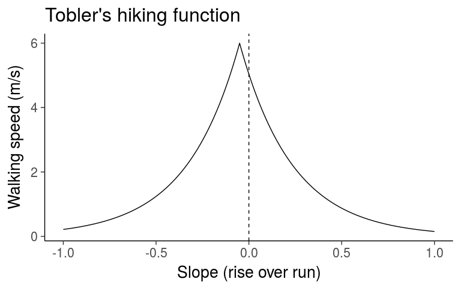

# R Notebook


```r
tobler <- function(x){
  6 * exp(-3.5 * abs(x + .05))
}
```


```r
library(tidyverse)
```

```
## Loading tidyverse: ggplot2
## Loading tidyverse: tibble
## Loading tidyverse: tidyr
## Loading tidyverse: readr
## Loading tidyverse: purrr
## Loading tidyverse: dplyr
```

```
## Conflicts with tidy packages ----------------------------------------------
```

```
## filter(): dplyr, stats
## lag():    dplyr, stats
```


```r
slope <- seq(-1, 1, .01)
qplot(slope, tobler(slope), geom = 'line' ) +
  geom_vline(xintercept = 0, linetype = 2) +
  labs(x = 'Slope (rise over run)', y = 'Walking speed (m/s)', title = "Tobler's hiking function") +
  theme_classic(base_size = 20)
```

<!-- -->

